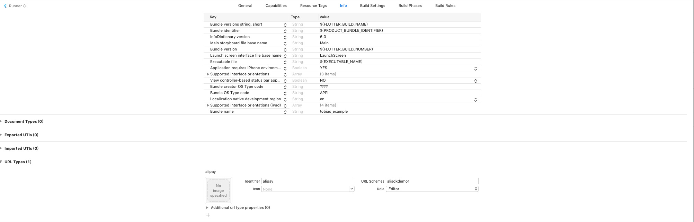

[中文移步这里](./README_CN.md)

QQ Group：892398530。

## What's Tobias

Tobias is a  flutter plugin for AliPaySDK.

## Getting Started

I highly recommend that you read this [article](https://docs.open.alipay.com/204/105051/) before using tobias.
Tobias helps you to do something but not all.
For example, you have to configure your URL Scheme on iOS.


## Payment
It's simple,pass Tobias your order info from server :
```dart
import 'package:tobias/tobias.dart' as tobias;
tobias.pay(yourOrder);
```
The result is map contains results from AliPay.The result also contains an external filed named `platform` which
means the result is from `iOS` or `android`.
Result sample:
```dart
{
result: partner="2088411752388544"&seller_id="etongka123@163.com"&out_trade_no="180926084213001"&subject="test pay"&total_fee="0.01"&notify_url="http://127.0.0.1/alipay001"&service="mobile.securitypay.pay"&payment_type="1"&_input_charset="utf-8"&it_b_pay="30m"&return_url="m.alipay.com"&success="true"&sign_type="RSA"&sign="nCZ8MDhsNvYNAbrLZJZ2VUy6vydgAp+JCq1aQo6ORDYtI9zwtnja3qNGQNiDJCuktoIj7fSTM487XhjPDqnOreZjIA1GJpxu9D1I3nMXIn1M7DfZ0noDwXcYZ438/jbYac7g8mhpwdKGweLCAni9mO3Y6q3iBFkox8i9PcsGxJY=",
resultStatus: 9000,
 memo: ,
 platform:iOS
}

```

## Auth

```
    tobias.auth("your auth str");

```

## Check AliPay Installation

```
    var result = await tobias.isAliPayInstalled();
   
```


> NOTE:Tobias use pay_V2.

For iOS,yout have to add url schema named `alipay`.
On Xcode GUI:



in your `info.plist`:
```
     <array>
   		<dict>
   			<key>CFBundleTypeRole</key>
   			<string>Editor</string>
   			<key>CFBundleURLName</key>
   			<string>alipay</string>
   			<key>CFBundleURLSchemes</key>
   			<array>
   				<string>tobias_example</string>
   			</array>
   		</dict>
   	</array>

```

You can also call `tobias.version()` which returns a map contains `version` and `platform`.


## Upgrade to 1.0.0

There's no need to override `AppDelegate` since `tobais 1.0.0`. If you have did thad before, please remove 
the following code in your `AppDelegate`:

```objective-c

- (BOOL)application:(UIApplication *)application openURL:(NSURL *)url sourceApplication:(NSString *)sourceApplication annotation:(id)annotation {
  return [TobiasPlugin handleOpenURL:url];
}
- (BOOL)application:(UIApplication *)application openURL:(NSURL *)url options:(NSDictionary<NSString*, id> *)options
{
  return [TobiasPlugin handleOpenURL:url];
}
```

If you have to override these two functions,make sure you have called the `super`:
```objective-c

- (BOOL)application:(UIApplication *)application openURL:(NSURL *)url sourceApplication:(NSString *)sourceApplication annotation:(id)annotation {
    
  return [super application:application openURL:url sourceApplication:sourceApplication annotation:annotation];
}
- (BOOL)application:(UIApplication *)application openURL:(NSURL *)url options:(NSDictionary<NSString*, id> *)options
{
    
  return [super application:application openURL:url options:options];
}
```


### Donate
Buy the writer a cup of coffee。

  


### Subscribe Us On WeChat


## LICENSE


    Copyright 2018 OpenFlutter Project

    Licensed to the Apache Software Foundation (ASF) under one or more contributor
    license agreements.  See the NOTICE file distributed with this work for
    additional information regarding copyright ownership.  The ASF licenses this
    file to you under the Apache License, Version 2.0 (the "License"); you may not
    use this file except in compliance with the License.  You may obtain a copy of
    the License at

    http://www.apache.org/licenses/LICENSE-2.0

    Unless required by applicable law or agreed to in writing, software
    distributed under the License is distributed on an "AS IS" BASIS, WITHOUT
    WARRANTIES OR CONDITIONS OF ANY KIND, either express or implied.  See the
    License for the specific language governing permissions and limitations under
    the License.
